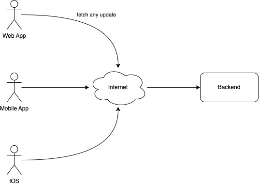
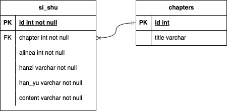

# San Jiao App (三教圣人)

## Intro

This is a hoby project of mine to develop an application to support chinese folks religion (Buddha, Dao and Ru Jiao).

The purpose of this app is to provide a simple, reliable and all in one apps that can be opened any time and at any place on any platform.

> Yes, I am a young and dump software angineer that walk around between temple and loves to deep dive into these three religion.

## Tech Stack

<table border=1>
    <thead>
        <tr>
            <th>
                Technology
            </th>
            <th>
                Description
            </th>
        </tr>
    </thead>
    <tbody>
        <tr>
            <td>Front-end</td>
            <td>Flutter</td>
        </tr>
        <tr>
            <td>Back-end</td>
            <td>Golang</td>
        </tr>
        <tr>
            <td>Database</td>
            <td>PostgreSQL</td>
        </tr>
    </tbody>
</table>

## Application Design

### System Design

Application is going to be APK based for Mobile and IOS. If possible, I want the app to be in a public.

### Entity Relational Database (ERD)

- Si Shu （四书-孔教）

## Project Planning

Implemented in:
- [ ] Web App
- [ ] Moblie App
- [ ] IOS

